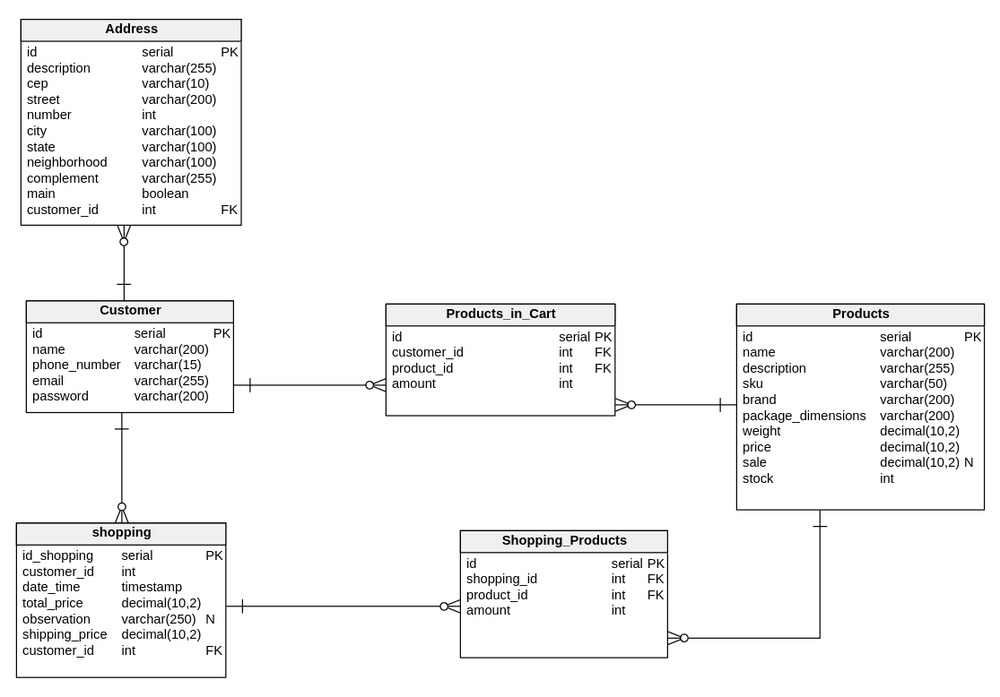

# MABEC - E-commerce

## Tabela de Conteúdos

- [Visão Geral](#1-visão-geral)
- [Diagrama ER](#2-diagrama-er)
- [Estrutura do banco de dados](#3-estrutura-do-banco-de-dados)

## 1. Visão Geral

O projeto MABEC é um página web para um e-commerce de produtos eletrônicos como computadores, peças de computadores,
periféricos, notebooks, smartphones, consoles, headsets, etc. 
O usuário pode criar o seu perfil, navegar por uma vitrine de produtos disponíveis e realizar compras.

No escopo do projeto temos as funcionalidades:

Para cliente:
- Vitrine de produtos
- Criação do perfil do usuário
- Perfil
- Login
- Produto
- Carrinho de compras
- Confirmação de pedido

Para administrador(ou vendedor):
- Inserir/excluir/alterar produtos
- Listar produtos
- Visualizar produtos mais vendidos ou por ID
- Listar clientes
- Visualizar cliente por ID
- Visualizar clientes que compraram X produto
- Visão geral (metricas) das vendas

A loja poderá:
- Registrar produtos
- Mostrar vitrine de produtos
- Permitir pesquisas com diferentes filtros
- Registrar pedidos
- Enviar pedidos ao vendedor (ou administrador)
- Armazenar/alterar e mostrar o estado de cada pedido (Em confirmação, confirmado, em andamento, concluido/entregue)
- Emitir nota fiscal

## 2. Diagrama ER

[ Voltar para o topo ](#tabela-de-conteúdos)

Diagrama ER da API definindo bem as relações entre as tabelas do banco de dados.

## 3. Estrutura do banco de dados

[ Voltar para o topo ](#tabela-de-conteúdos)

- Cliente: 

  - id: Chave Primaria
  - name: Nome do Cliente
  - phone_number: Telefone do cliente
  - email: Email Pessoal
  - password: Senha do cliente

- Endereço:

  - id: Chave Primaria
  - description: Nome Personalizado do endereço(Ex.: Casa)
  - cep: CEP
  - street: Rua do Cliente
  - number: Numero da casa do cliente
  - city: Cidade
  - state: Estado
  - neighborhood: Bairro.
  - complement: Complemento (Ex.: Apartamento 203)
  - main: Atributo boleano para verificar se é o principal.
  - user_id: Id do usuario.

- Produtos: 

  - id: Chave Primaria
  - name: Nome do produto 
  - description: Descrição do produto
  - sku: Código de barra
  - brand: Marca do Produto
  - package_dimensions: Dimensões do Pacote
  - weight: Peso do Produto
  - price: Preço
  - sale: Preço de promoção. Atributo nulavel. 
  - stock: Qauntidade do Produto Disponivel no estoque.  

- Produtos Adicionados ao carrinho:
 
  - id: Chave Primaria
  - customer_id: Id do comprador
  - product_id: ID do produto
  - amount: Quantidade do produto

- Shopping: 

  - id: Chave Primaria
  - customer_id: ID do Cliente
  - date_time: Data e horario da venda.
  - total_price: Preço total.
  - observation: Observação do cliente. Nulavel.
  - shipping_price: Valor do frete.

- Compras_Produtos (Tabela Intermediaria entre Shopping e Product)

  - id: Chave Primaria
  - shopping_id: ID da tabela venda
  - product_id: ID do produto
  - amount: Quantidades
